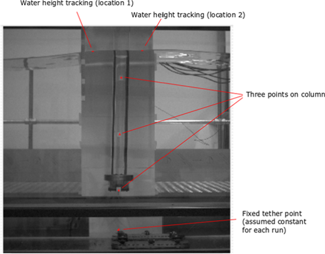
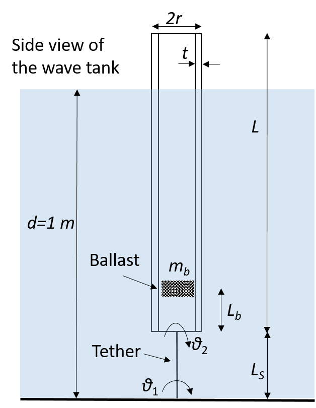
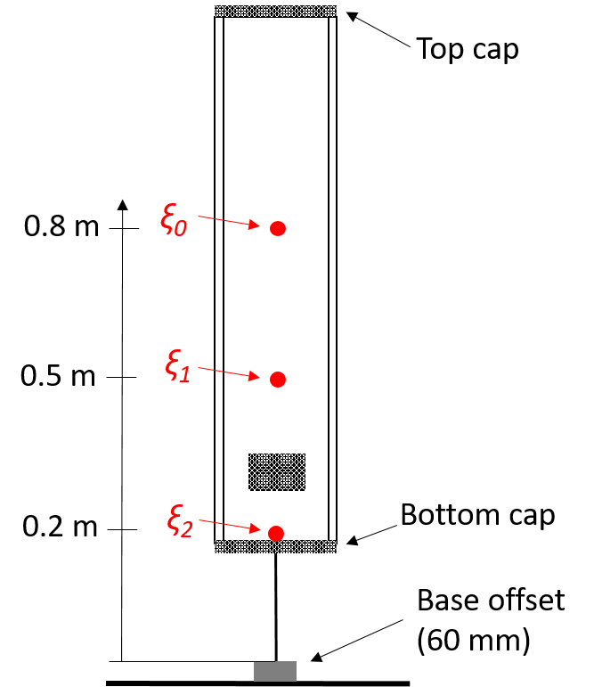
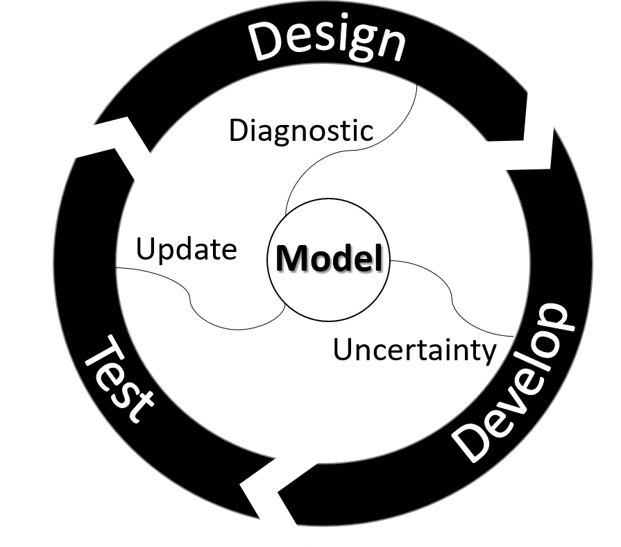
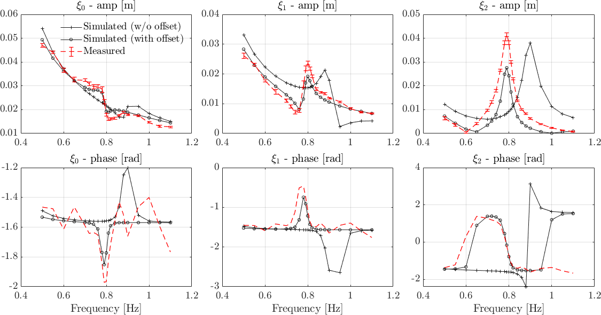

# SA4DesignCaseStudy
Case study for sensitivity analysis using a model wind turbine floating  platform

Fig - Experimental set up (left), proposed design (middle) and developed design (right)

This case study is used to demonstrate the role of the sensitivity analysis for diagnostic of the virtual design, critical uncertainty identification for development guidance and focused model updating using measured data. 

To implement the numerical case studies, you need to download the sensitivity code of [TEDS](/../../../../longitude-jyang/TEDS-ToolboxEngineeringDesignSensitivity) from a different repository. The functions are [call_caseNo1.m](/codes/call_caseNo1.m) for design diagnostic, [call_caseNo2.m](/codes/call_caseNo2.m) for critical uncertainties and [call_caseNo3.m](/codes/call_caseNo3.m) for focused updating. the hydrodynamic code [CHAOS](https://github.com/longitude-jyang/hydro-suite) is used throughout the case study.

One of the key findings is that the small offset, introduced for installation reasons, has been neglected in our initial examination of the developed design. This is because the base plate fixture does not affect the fixed boundary condition of the proposed design. However, it turns out that this small offset has significant (confounding) effect on the dynamics and we are going to demonstrate how the sensitivity analysis leads us to focus on this discrepancy that would otherwise be considered as negligible. 

